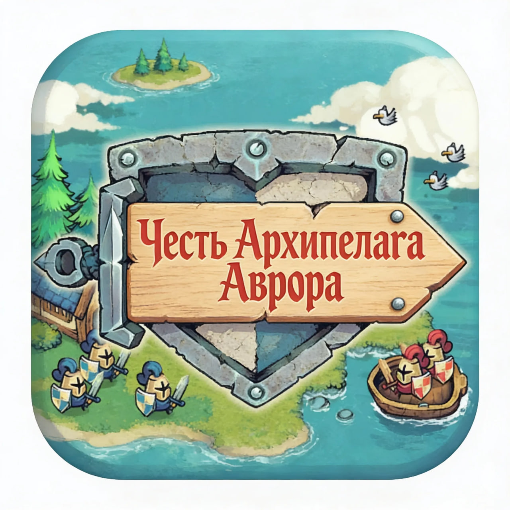

# Честь Архипелага Аврора — 2D RPG для Aurora OS

*Захватывающее приключение в мире таинственных островов*

## 🎮 О проекте

**Честь Архипелага Аврора** — это двумерная ролевая игра (2D RPG), разработанная на движке **Godot Engine** в качестве учебного проекта, предназначенного для работы в операционной системе **«Аврора»**.

Вы играете за рыцаря в силе Средневековья, чья задача — исследовать разрозненный архипелаг загадочных островов. Каждый остров — это уникальная локация со своей историей, ландшафтом, опасностями и цепочкой заданий. Ваша цель — выполнять миссии, раскрывать тайны мира и укреплять свою доблесть.

Проект создан для изучения принципов геймдизайна, работы с Godot под специфичную среду Aurora OS.

## ✨ Ключевые особенности

*   **Исследование мира:** Путешествуйте по разнообразным островам — от туманных болот и густых лесов до скалистых побережий и горных вершин.
*   **Динамические бои:** Тактическая боевая система в реальном времени с использованием меча, щита и, возможно, базовой магии.
*   **Прогрессия персонажа:** Улучшайте характеристики рыцаря, находите новое снаряжение и экипировку.
*   **Атмосфера:** Стилизованная 2D-графика, создающая ощущение средневекового приключения, и минималистичный саундтрек.
*   **Для Aurora OS:** Специально собран и протестирован для работы в среде ОС «Аврора», с учетом ее особенностей.

## 🛠 Технологический стек

*   **Движок:** Godot Engine версия 4
*   **Язык программирования:** GDScript
*   **Графика:** 2D векторная
*   **Аудио:** WAV/OGG (поддержка кодеков Aurora OS)
*   **Целевая платформа:** **Aurora OS** 
*   **Система контроля версий:** Git
