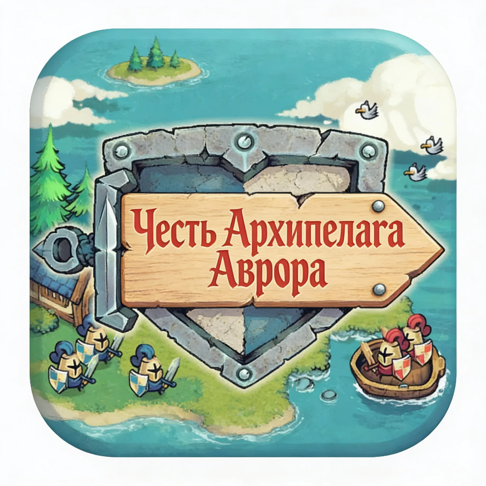
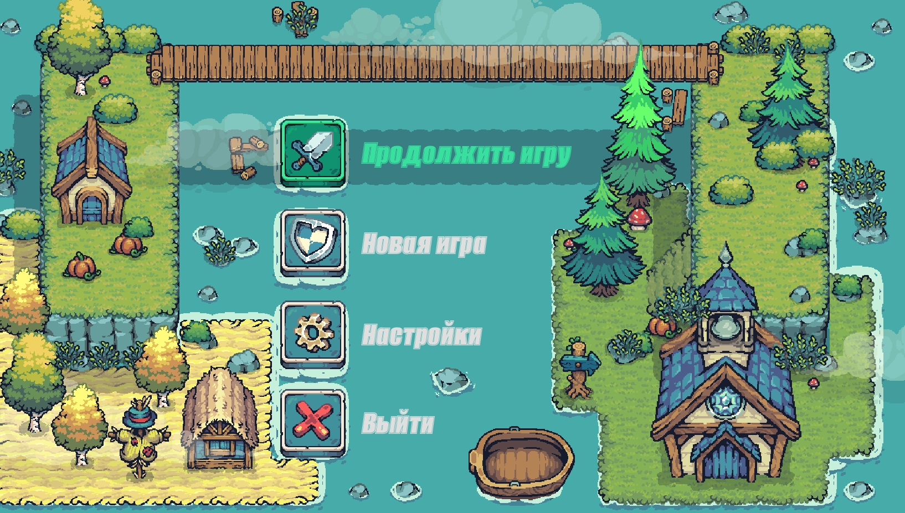
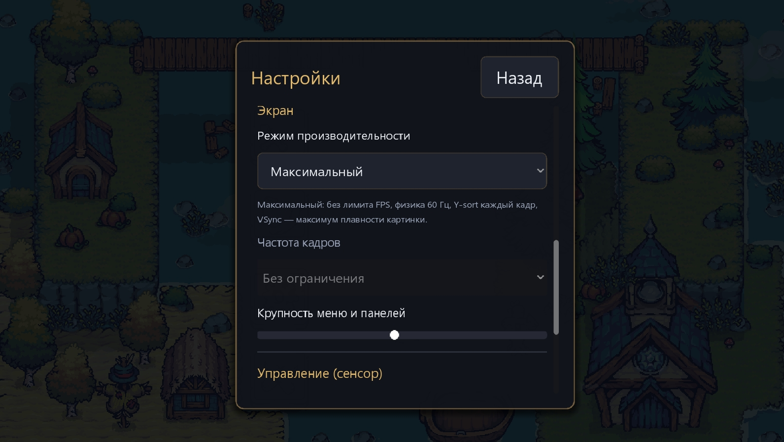
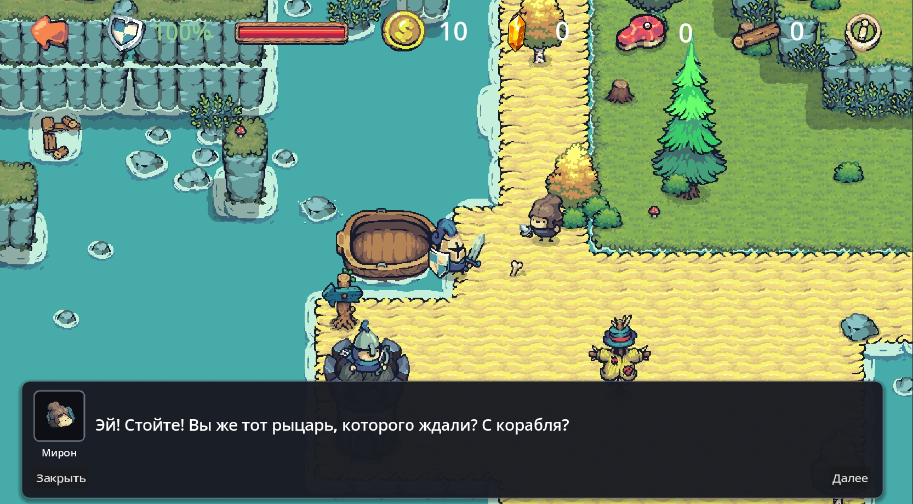
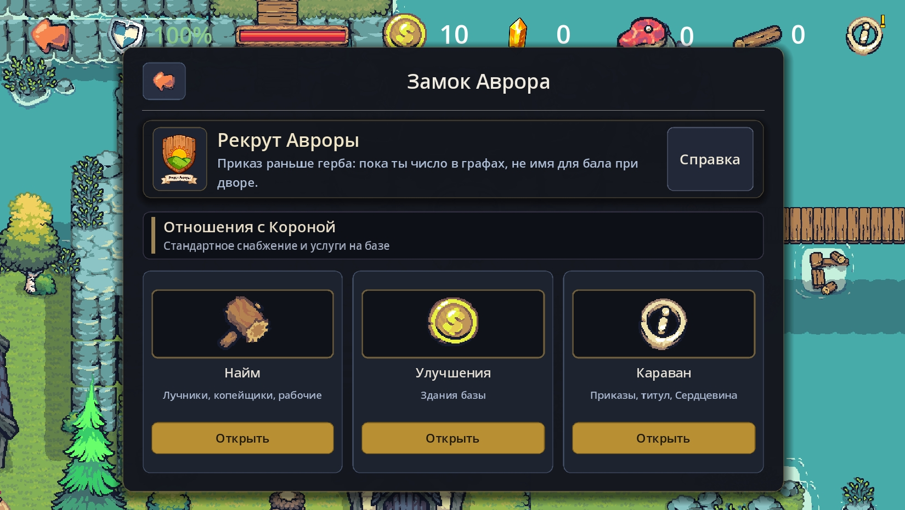
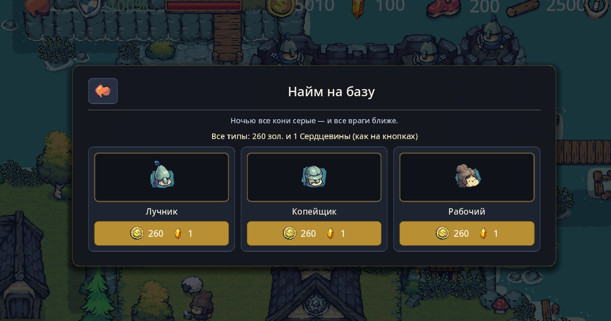
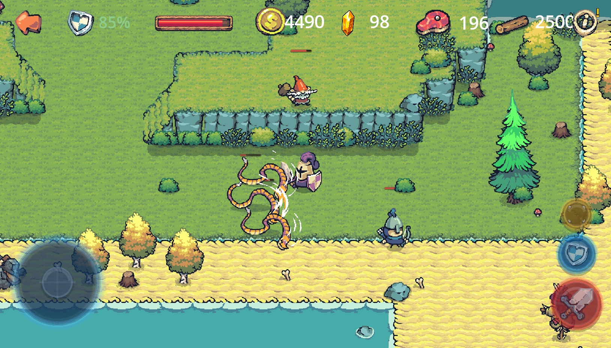

<div align="center">



# Честь Архипелага Аврора

### *Honor of Aurora*

**2D RPG на Godot** · архипелаг · отряд · сюжет и Коронная система

[](https://godotengine.org/)
[](https://docs.godotengine.org/en/stable/tutorials/rendering/rendering_method.html)
[](LICENSE)

</div>

---

## О проекте

**Честь Архипелага Аврора** — изометрическое 2D‑приключение: вы исследуете острова, ведёте бой в реальном времени и развиваете связь с **отрядом** и **сюжетом**. Проект изначально ориентирован на среду **ОС «Аврора»** (сенсорный ввод, совместимый рендер) и собран как полноценная учебная/портфолио‑игра на **Godot 4.4**, а не как минимальный прототип.

Исходный код и сцены лежат в каталоге [`honor-of-aurora/`](honor-of-aurora/) — это корень проекта Godot (`project.godot`).

---

## Что уже есть в игре

| Направление | Содержание |
|-------------|------------|
| **Бой** | Герой‑воин: меч, щит, здоровье и уровни; союзники (в т.ч. лучник), враги, физические слои для игрока, врагов, союзников, стрел и зон |
| **Отряд** | Меню **приказов отряду**, состояние боя отряда, интеграция с геймплеем (например, подавление «ложной» атаки после закрытия UI) |
| **Сюжет и диалоги** | `DialogueManager`, реестр диалогов, окна диалогов; сюжетное состояние и пост‑финальная логика мира |
| **Мета‑прогресс** | Сохранения, сложность, баланс, менеджер геймплея, звук |
| **Корона и снабжение** | Система **немилости / одобрения Короны**, влияние на исцеление, привал, стоимости, урон лучников; **износ снаряжения** и ремонт — см. [`CHANGELOG_LORE.md`](CHANGELOG_LORE.md) |
| **Платформа** | Окно **1280×720**, растягивание `canvas_items`, эмуляция мыши с тача для UI, мобильный виртуальный ввод |

Подробные **решения по канону и лору** фиксируются в [`CHANGELOG_LORE.md`](CHANGELOG_LORE.md).

---

## Галерея

Ниже — актуальные кадры из сборки. **Полоса превью:** прокручивайте страницу по горизонтали (колёсико + Shift или жест тачпада), если окно узкое и картинки в один ряд не помещаются. **Каждый кадр** можно развернуть: полный размер и пояснение — внутри блоков.

<p align="center">







</p>

<details>
<summary><strong>1 — Главное меню</strong></summary>


Точка входа: фон — живой **пиксель-арт острова** (вода, мост, дома, шлюпка, пугало). Пункты **«Продолжить»**, **«Новая игра»**, **«Настройки»**, **«Выйти»** с иконками (меч, щит, шестерёнка, крестик); выделение **зелёной подсветкой**. Сразу видно стиль мира и локализацию на русский.

</details>

<details>
<summary><strong>2 — Настройки</strong></summary>


Полупрозрачная панель поверх того же мира. Блок **«Экран»**: профиль **«Режим производительности»** (на кадре — *Максимальный*: без лимита FPS, физика 60 Гц, Y-sort каждый кадр, VSync), отдельно **частота кадров** и **ползунок крупности UI** — удобно под разные экраны и **сенсор**. Внизу намечен блок **«Управление (сенсор)»** (меню прокручивается).

</details>

<details>
<summary><strong>3 — Первый контакт: Мирон у причала</strong></summary>


**Геймплей + диалог:** рыцарь у лодки, островной пейзаж. Внизу — окно с портретом **Мирона** и репликой про ожидаемого с корабля рыцаря. Сверху **HUD**: щит с процентом, полоска здоровья, ресурсы (золото, кристаллы, провизия, дерево), кнопки **«Закрыть»** / **«Далее»**. Хорошо иллюстрирует **нарратив** и **экономику** в одном кадре.

</details>

<details>
<summary><strong>4 — Замок Аврора (хаб базы)</strong></summary>


Центральный **мета-экран базы**: титул **«Рекрут Авроры»**, герб, лаконичная «дворцовая» подпись и кнопка **«Справка»**. Блок **«Отношения с Короной»** и снабжение на базе. Три карточки — **Найм** (лучники, копейщики, рабочие), **Улучшения** (здания), **Караван** (приказы, титул, Сердцевина). Сверху тот же ресурсный HUD.

</details>

<details>
<summary><strong>5 — Замок Аврора (тот же экран, другой ракурс мира)</strong></summary>


По сути **тот же интерфейс «Замок Аврора»**, что и на кадре 4, но фон показывает другой фрагмент карты (вода, пирс, деревья). Удобно оценить, как **UI читается** на разных участках локации.

</details>

<details>
<summary><strong>6 — Найм на базу</strong></summary>


Экран **«Найм на базу»** с эпиграфом и тремя слотами: **лучник**, **копейщик**, **рабочий** — у каждого своя цена в золоте и **Сердцевине** (кристалл). На фоне видна **укреплённая база** у воды. Верхняя панель с богатым набором ресурсов показывает **прогрессию** после стартовых кадров.

</details>

<details>
<summary><strong>7 — Бой в реальном времени и отряд</strong></summary>


**Боёвка:** герой в сражении с крупным **многоглавым змееподобным врагом**, вспышки ударов; рядом союзники (**лучник**, персонаж с булавой). HUD с ресурсами, **щит с процентом** (на кадре снижен относительно 100% — видно влияние боя или износа). Внизу — **виртуальный джойстик** и кнопки **щит / меч** — мобильный сценарий в лоб.

</details>

---

## Технологии

| Компонент | Версия / детали |
|-----------|-----------------|
| Движок | **Godot 4.4** (`config/features`: `4.4`, **GL Compatibility**) |
| Язык | **GDScript** |
| Рендеринг | `gl_compatibility`, пиксельное привязывание 2D, при необходимости сжатие текстур под мобильные GPU |
| Аудио | OGG и др. (см. [`honor-of-aurora/audio/LICENSE_SOURCES.txt`](honor-of-aurora/audio/LICENSE_SOURCES.txt) при необходимости атрибуции) |
| Репозиторий | Git |

---

## Быстрый старт

1. Установите [**Godot 4.4**](https://godotengine.org/download) (или совместимую 4.x с тем же проектом).
2. Клонируйте репозиторий или скачайте архив.
3. В Godot: **Import** → укажите файл  
   `honor-of-aurora/project.godot`  
   либо откройте папку `honor-of-aurora` как проект.
4. Запустите сцену с **Main Scene**, заданной в проекте (меню **Project → Project Settings → Application → Run**).

> **Совет:** для целевой сборки под Аврору ориентируйтесь на экспорт с **GL Compatibility** и проверку ввода на сенсоре — в `project.godot` уже включена эмуляция мыши с касаний для стандартного UI.

---

## Структура репозитория (кратко)

```
Double_win/
├── honor-of-aurora/     # проект Godot (сцены, скрипты, ресурсы)
├── images/              # материалы вне движка, в т.ч. логотип для README
├── screen_shots/        # скриншоты для README и портфолио
├── story_icon_candidates/
├── CHANGELOG_LORE.md    # канон и нарративные решения
├── LICENSE              # MIT
└── README.md
```

---

## Лицензия

Проект распространяется по лицензии **MIT** — см. файл [`LICENSE`](LICENSE).

---

<div align="center">

*Остров за островом — приказ за приказом.*

</div>
