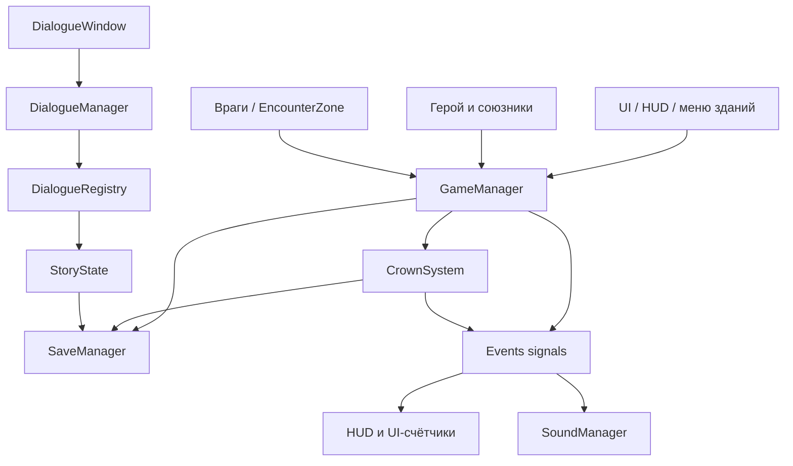

# Архитектура игры

## Общая структура проекта

Проект находится в `honor-of-aurora/` и является Godot 4.4 проектом. Главная сцена указана в `project.godot` через `run/main_scene`; локации переключаются не напрямую из UI, а через `GameManager.handle_location_changed`.

Ключевые каталоги:

- `autoload/` - глобальные singleton-модули: сохранение, события, баланс, Корона, диалоги, менеджер игры, звук, погода, подсказки.
- `Game/` - сцены-контейнеры игровых локаций: база, острова 1-5, меню.
- `world/` - острова, навигация, encounter-зоны, ресурсы тайлмапов.
- `ally/`, `characters/`, `enemies/` - герой, союзники, враги, базовые классы юнитов.
- `objects/` - интерактивные зоны, здания, сундуки, pickup-ресурсы, телепорт.
- `ui/` - HUD, меню замка, меню отряда, диалоги, настройки, мобильное управление.
- `dialogue/` - ресурсы и скрипты диалогов, сюжетные ветки.

## Главный архитектурный принцип

Игра построена вокруг autoload-синглтонов и событий. Сцены являются временными контейнерами, а прогресс живёт в `SaveManager`. При смене сцены `GameManager` заново создаёт героя и сохранённый отряд, синхронизирует ресурсы, применяет настройки, погоду, ночной слой, постфинальные эффекты и HUD-события.

## Смена локаций

Локации заданы enum `Events.LOCATION`: `BASE`, `LVL1` ... `LVL5`, `MENU`. `GameManager` содержит словарь путей к сценам и управляет переходом:

- завершает активный диалог перед сменой сцены;
- сбрасывает `get_tree().paused`, чтобы герой не зависал после UI/диалогов;
- при уходе в меню сохраняет текущую локацию, позицию и HP героя;
- при возврате с острова на базу увеличивает `expedition_return_count`;
- сбрасывает походные бафы казарм/монастыря/стрельбища;
- сбрасывает прогресс сундуков острова после экспедиции;
- если босс острова не убит, сбрасывает зачистку encounter-зон острова;
- собирает доход шахты;
- двигает счётчик каравана/приказа Короны;
- создаёт новую сцену, спавнит героя и сохранённый отряд.

Важная деталь: переходы из меню на базу используют overlay-сцену, чтобы не было пустого кадра. Переходы между игровыми сценами закрываются облачным/тёмным переходом через `MenuStartTransition`.

## Сцены и узлы

Типичная игровая сцена состоит из:

- корневого узла локации;
- TileMapLayer-слоёв земли, воды, мостов и препятствий;
- зон спавна игрока и отряда;
- `TeleportZone` для переходов;
- `EncounterZone` для боевых волн;
- интерактивных зон зданий/диалогов/сундуков;
- HUD как CanvasLayer.

Герой не является постоянным узлом между сценами. Он создаётся заново из `ally/player/scenes/worrier_base.tscn`, затем `sync_from_save()` подтягивает уровень, опыт и здоровье. Аналогично спавнятся сохранённые лучники, копейщики, рабочие и сюжетный Мирон.

## Событийная шина

`Events.gd` - глобальная шина сигналов. Через неё общаются системы, которые не должны напрямую знать друг о друге:

- ресурсы: `gold_changed`, `meat_changed`, `wood_changed`, `ore_changed`;
- переходы: `location_changed`, `expedition_returned`;
- Корона: `caravan_arrived`, `caravan_pending_changed`, `caravan_dispatched`, `crown_title_changed`, `crown_displeasure_changed`, `crown_favor_changed`;
- снаряжение: `armor_durability_changed`;
- шахта и отдых: `mine_harvested`, `rest_used`;
- отряд: `squad_orders_menu_closed`;
- сундуки: `chest_opened`.

Такой подход позволяет HUD, меню, звук, диалоги и сохранение обновляться без жёстких ссылок.

## Сохранение как центральная модель состояния

`SaveManager` хранит почти весь долгосрочный прогресс:

- ресурсы: золото, мясо, дерево, руда;
- герой: HP, уровень, опыт, смерть, бонусы HP/скорости;
- отряд: количество лучников, копейщиков, рабочих;
- база: уровни зданий;
- острова: зачистка зон, сундуки, rolled loot;
- Корона: отправленная руда, текущий приказ, сроки, караван, немилость, одобрение, титул, прочность снаряжения;
- сюжет: `story_flags`;
- настройки: звук, UI scale, touch controls, performance mode, FPS.

`SaveManager` использует `user://game_save_file.save`, миграции старых полей и throttle записи на диск. Быстрые изменения могут идти через deferred/soft save, но критичные сюжетные флаги пишутся сразу.

## Бой и персонажи на уровне архитектуры

Базовый класс боевых сущностей - `characters/character_unit.gd`. Он добавляет:

- `HealthComponent`;
- мини HP-бар вне базы;
- группы `character_unit`, `y_sortable`;
- мягкое раздвижение юнитов;
- кэш группы юнитов и игрока на физический кадр для оптимизации.

Герой наследует `PlayerCharacter` и реализован в `worrier_base.gd`. Враги наследуют `enemy_base.gd`. Союзники имеют свои специализированные скрипты: лучник, монах, рабочий, копейщик, пешка/рудокоп.

## Encounter-система островов

`EncounterZone` - Area2D-зона, которая стартует волны при входе игрока:

- хранит `zone_id`, `island_key`, `island_tier`, список волн;
- спавнит врагов из `EncounterWaveEntry`;
- ограничивает максимум активных врагов в зоне;
- назначает врагам ссылку на зону и leash-radius;
- помечает зону очищенной в `SaveManager.island_zone_state`;
- уведомляет `EncounterDirector`, а тот может выдать ресурсы.

Если игрок вернулся на базу, а босс острова не убит, сохранённые зачистки зон этого острова очищаются. Если босс убит, зачистка остаётся.

## UI-архитектура

HUD управляет игровыми окнами: меню замка, телепорт, отряд, диалоги, ресурсы, HP. Большая часть UI обновляется через `Events`. Меню зданий не держат экономику внутри себя: они вызывают `GameManager`, `CrownSystem`, `GameplayFacade`, `BalanceConfig`.

`DialogueWindow` подписан на `DialogueManager.line_changed` и отображает текущую реплику, выборы и прогресс диалога.
